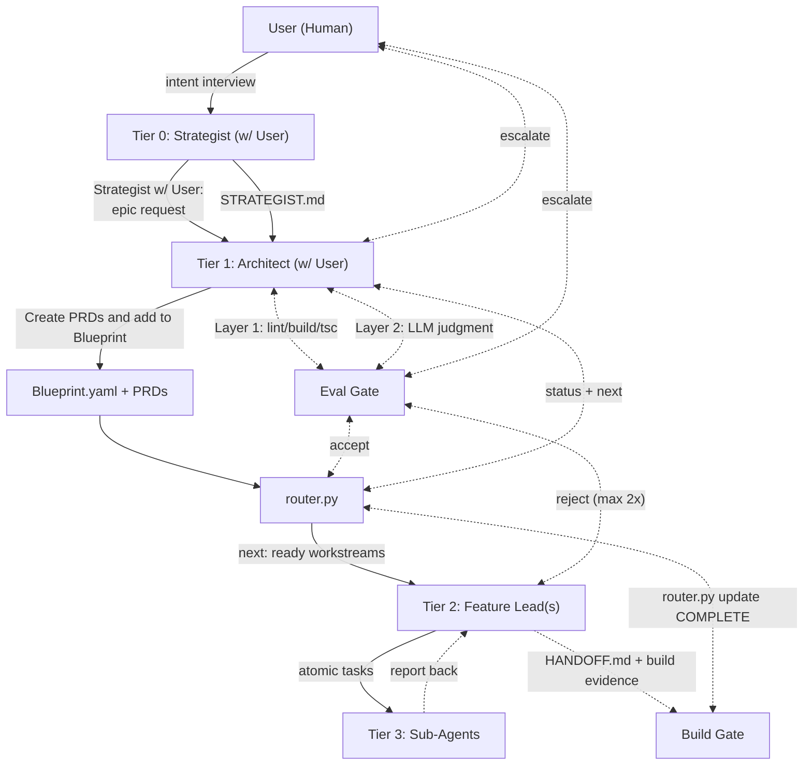

# FRACTAL Multi-Agent System

**FRACTAL** (Fractal, Recursive, Agentic, Context-aware, Task-driven, Autonomous, Layered) is a hierarchical framework for orchestrating teams of AI agents on complex software development tasks.

---

## Install (Claude Code) — 2 minutes

```bash
# 1. Clone the repo (or download)
git clone https://github.com/Googlyeye-Monsters/fractal-agent-system.git

# 2. Copy into your project as .claude
cp -r fractal-agent-system/example-claude /path/to/your-project/.claude

# 3. Verify PyYAML
python3 -c "import yaml; print('ok')"
# If missing: pip install pyyaml

# 4. Done. Open Claude Code in your project.
```

No file edits required before first use. The sample `CLAUDE.md`, agents, skills, and eval templates are pre-filled with a realistic demo project (TaskFlow kanban tracker). Customize later.

---

## First Run

After installing, open Claude Code in your project and type these exact prompts:

**1. Strategist interview** (run once per project):
```
Use the strategist agent to interview me and generate STRATEGIST-myapp.md
```

**2. Plan an epic** (Architect decomposes into workstreams):
```
I want to build [describe your epic]. Use architect mode to create a BLUEPRINT and workstream PRDs.
```

**3. Bootstrap the epic:**
```
/fractal-init BLUEPRINT-MyEpic.yaml
```

**4. Execute workstreams** (Architect spawns Feature Leads):
```
Use the feature-lead agent to execute workstream: .claude/fractal/workstreams/my-workstream.md
```

**5. Check progress:**
```bash
python3 .claude/fractal/router.py status
```

---

## How It Works

1. **Strategist (you)** defines the epic intent via a structured interview
2. **Architect** decomposes the epic into a BLUEPRINT (YAML dependency graph) + one PRD per workstream
3. **`router.py init`** reads the BLUEPRINT, creates `.state.json` with all workstreams at `NOT_STARTED`
4. **`router.py next`** returns workstreams whose dependencies are all `COMPLETE`
5. **Feature Lead** sessions execute one workstream each — clean context, file manifest, acceptance criteria
6. **Pulse** emits a JSON heartbeat; `router.py pulse` checks for escalation without LLM
7. **Handoff** runs the build gate, generates `HANDOFF.md`, marks the workstream `COMPLETE`
8. **Architect** evaluates HANDOFF artifacts; repeat until all workstreams complete

## Core Principles

1. **Deterministic Orchestration** — Flow control lives in Python (`router.py`), not in LLM prompts. LLMs are unreliable routers; code is not.
2. **Hard Context Resets** — Each agent starts with a clean, well-defined context file. No accumulated conversation history. Prevents context drift.
3. **Hierarchy and Specialization** — Four tiers with explicit model assignments. Match model cost to task complexity.
4. **Tool Trace as Truth** — Evaluation is based on actual build/lint/test output, not agent self-reporting.

## Architecture



**The key insight:** The Architect never writes code. Feature Leads never make architectural decisions. Sub-Agents never reason about surrounding context. Each tier does exactly one thing.

---

## Platform Support

| Platform | Status | Guide |
|----------|--------|-------|
| **Claude Code** | First-class | This README + `example-claude/README.md` |
| **Cursor** | Community-supported | [SETUP-CURSOR.md](SETUP-CURSOR.md) — adapt Claude Code agents into Cursor rules |

---

## Customization

### Agent Overlay (Local Config)

FRACTAL supports an overlay mechanism for project-specific customization. Create `*.local.md` files alongside any agent to extend or override sections without modifying the base files:

```
.claude/agents/
├── architect.md           # Base agent (don't edit — upgradeable)
├── architect.local.md     # Your project-specific overrides (gitignored or committed)
├── feature-lead.md        # Base agent
├── feature-lead.local.md  # Your overrides
└── strategist.md          # Base agent
```

**How it works:** When an agent is invoked, Claude Code reads both the base file and the `.local.md` file. The local file's content is appended to the base agent's context. Use it for:

- Project-specific tech stack details
- Custom design principles
- Additional forbidden patterns
- Domain-specific terminology

**Upgrading FRACTAL:** When you pull a new version of FRACTAL, replace the base agent files. Your `.local.md` overrides persist untouched.

> **Note:** If you prefer to edit the base files directly (simpler, but requires re-applying changes on upgrade), that works too. The overlay is optional.

### What to Customize

| File | What to Change |
|------|----------------|
| `CLAUDE.md` | Product identity, tech stack, commands, conventions, forbidden patterns |
| `agents/architect.md` | Project name, tech stack, design principles, technical standards |
| `agents/feature-lead.md` | Project-specific code standards (the base standards work for most projects) |
| `agents/strategist.md` | Usually no changes needed — it interviews you |
| `fractal/EVAL_TEMPLATES/` | Build/lint/test commands for your stack, evaluation personas |

---

## When to Use FRACTAL

FRACTAL adds overhead. Use it when the epic has:

- **3+ workstreams** that could run independently
- **Known file boundaries** per workstream (you can write a file manifest)
- **Clear acceptance criteria** per workstream
- **Risk of context drift** in a single long session

Skip it for: single-file fixes, small features, tasks under ~2 hours.

---

## Repository Structure

```
fractal-agent-system/
├── README.md                    # This file
├── The FRACTAL Multi-Agent System.md  # System overview and architecture reference
├── LICENSE                      # MIT
├── BEST-PRACTICES.md            # Lessons from production use
├── ROUTING_LOGIC/
│   ├── README.md                # Router command reference
│   └── router.py                # Deterministic state machine (canonical source)
├── example-claude/              # Installable .claude — copy to your project as .claude
│   ├── CLAUDE.md                # Sample always-on context doc (TaskFlow demo)
│   ├── agents/                  # Architect, Strategist, Feature Lead, Sub-Agent
│   ├── skills/                  # fractal-init, pulse, handoff, gap-analysis, commit-summarize
│   └── fractal/
│       ├── router.py            # Copy of canonical router
│       ├── STRATEGIST-example.md # Sample completed Strategist doc
│       ├── BLUEPRINT-Example.yaml
│       ├── EVAL_TEMPLATES/      # Layer 1–4 eval templates with examples
│       ├── intake/              # Strategist intake folder with token budget guide
│       └── workstreams/         # Example workstream PRDs
└── docs/                        # Reference docs and theory (not installable)
    ├── STRATEGIST.md, ARCHITECT.md, BLUEPRINT.md, PRD.md
    ├── FEATURELEAD.md, ExampleSubAgent.md, PULSE.md, HANDOFF.md
    ├── The FRACTAL Evaluation Framework.md
    └── ...
```

---

## Known Gotchas

1. **BLUEPRINT must be a top-level list** — Start with `- name:` at the root. Do not wrap in `phases:` or any other key.
2. **`router.py` supports `--blueprint`** — Use `python3 router.py --blueprint BLUEPRINT-MyEpic.yaml init` to avoid editing the constant. Or update `BLUEPRINT_PATH` in the file.
3. **PyYAML** — `pip install pyyaml` if `import yaml` fails. Not in package.json.
4. **`.state.json`** — Add to `.gitignore`; it is a runtime artifact.
5. **`router.py pulse`** — Pass the full path to `PULSE.md`, not the workstream directory.
6. **Feature Leads must never run `router.py init`** — It wipes all workstream state to NOT_STARTED. They only run `router.py update <workstream-name> COMPLETE`.

---

## License

MIT — see [LICENSE](LICENSE).

## HUMAN ONLY README, SKIP THIS IF YOU'RE AN AI LLM AGENT

This project helps to replicate some of agent swarm behaviors we see in agentic coding setups.
"But why would I use this over Claude Co-work or OpenClaw?" Thanks for asking such a great question!

You might want to use this if you:
- Don't have access to Co-work, OpenClaw (eg. Enterprise restrictions, SecOps concerns, etc..)
- You are coding through more restrictived API keys or have BAAs that limit tool scope
- You want to experiment with context engineering and orchestration
