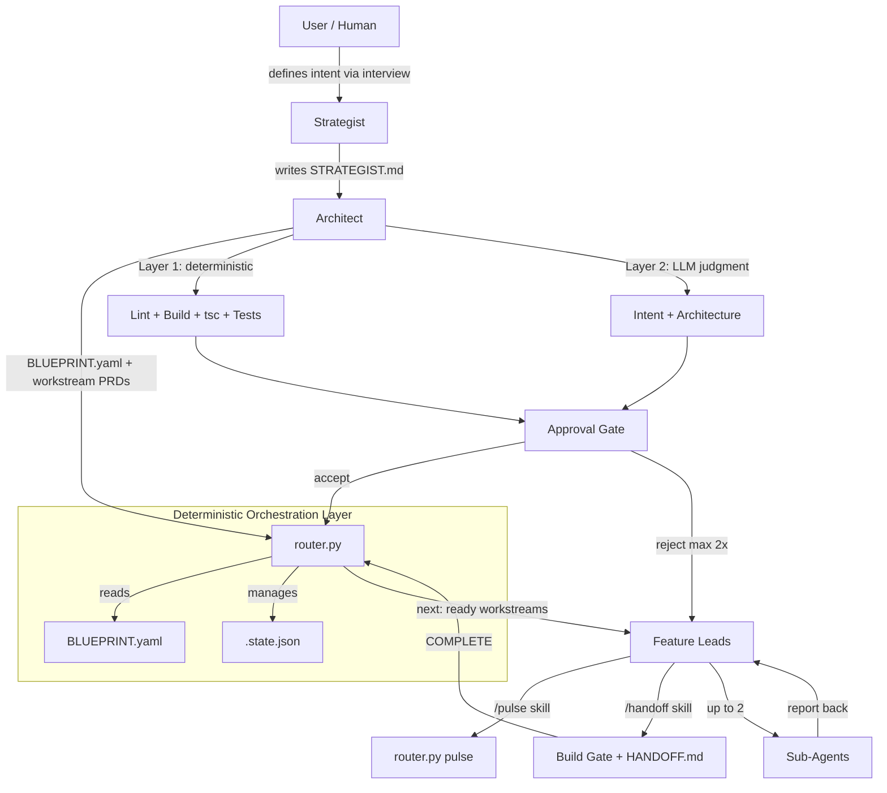

# FRACTAL Multi-Agent System

**FRACTAL** (Fractal, Recursive, Agentic, Context-aware, Task-driven, Autonomous, Layered) is a hierarchical framework for orchestrating teams of AI agents on complex software development tasks. It addresses context drift, serialization of parallel work, and cost inefficiency in long-running agentic sessions.

## Core Principles

1. **Deterministic Orchestration** — Flow control lives in Python (`router.py`), not in LLM prompts. LLMs are unreliable routers; code is not.
2. **Hard Context Resets** — Each agent starts with a clean, well-defined context file. No accumulated conversation history. Prevents context drift.
3. **Hierarchy and Specialization** — Four tiers with explicit model assignments. Match model cost to task complexity.
4. **Tool Trace as Truth** — Evaluation is based on actual build/lint/test output, not agent self-reporting.

## The Four-Tier Hierarchy

## Architecture Overview



**The key insight:** The Architect never writes code. Feature Leads never make architectural decisions. Sub-Agents never reason about surrounding context. Each tier does exactly one thing.

## Platform Support

| Platform | Setup Guide | Status |
|----------|-------------|--------|
| **Claude Code** (Anthropic CLI) | [SETUP-CLAUDE-CODE.md](SETUP-CLAUDE-CODE.md) | Implemented |
| **Cursor** | [SETUP-CURSOR.md](SETUP-CURSOR.md) | Implemented |
| OpenClaw | — | Planned |
| Generic CI/CD | — | Planned |

## Quick Start

### Claude Code

**Option A — Install full example (recommended):** Copy the ready-to-use folder so you get the full structure (agents, skills, FRACTAL with intake, ISSUES, EVAL_TEMPLATES, example blueprint):

```bash
cp -r fractal-agent-system/example-claude .claude
# Then edit .claude/FRACTAL/router.py (set BLUEPRINT_PATH) and add .gitignore entries (see SETUP-CLAUDE-CODE.md).
```

**Option B — Manual setup:**

```bash
# 1. Copy router and create directory structure (see SETUP-CLAUDE-CODE.md)
cp fractal-agent-system/ROUTING_LOGIC/router.py .claude/FRACTAL/router.py
# 2. Verify PyYAML
python3 -c "import yaml; print('ok')"
# 3. Create BLUEPRINT-{Epic}.yaml (top-level YAML list)
# 4. Initialize and run
python3 .claude/FRACTAL/router.py init
python3 .claude/FRACTAL/router.py next
```

### Cursor

```bash
# 1. Copy router and Cursor rules/skills (see SETUP-CURSOR.md)
mkdir -p .fractal/workstreams
cp fractal-agents-system/ROUTING_LOGIC/router.py .fractal/router.py
cp fractal-agents-system/cursor/rules/*.mdc .cursor/rules/
cp -r fractal-agents-system/cursor/skills/* .cursor/skills/
# 2. Verify PyYAML: python3 -c "import yaml; print('ok')"
# 3. Create .fractal/BLUEPRINT-{Epic}.yaml
# 4. python3 .fractal/router.py init && python3 .fractal/router.py next
```

Full step-by-step instructions: [SETUP-CLAUDE-CODE.md](SETUP-CLAUDE-CODE.md) | [SETUP-CURSOR.md](SETUP-CURSOR.md)

## How It Works

1. **Strategist (you)** defines the epic and invokes the Architect.
2. **Architect** decomposes the epic into a BLUEPRINT (YAML dependency graph), writes one PRD per workstream.
3. **`router.py init`** reads the BLUEPRINT, creates `.state.json` with all workstreams at `NOT_STARTED`.
4. **`router.py next`** returns workstreams whose dependencies are all `COMPLETE`.
5. **Feature Lead** sessions execute one workstream each — clean context, file manifest, acceptance criteria.
6. **Pulse** emits a JSON heartbeat; `router.py pulse` checks for escalation without LLM.
7. **Handoff** runs the build gate, generates `HANDOFF.md`, marks the workstream `COMPLETE`.
8. **Architect** evaluates HANDOFF artifacts; repeat until all workstreams complete.

## When to Use FRACTAL

FRACTAL adds overhead. Use it when the epic has:

- **3+ workstreams** that could run independently
- **Known file boundaries** per workstream (you can write a file manifest)
- **Clear acceptance criteria** per workstream
- **Risk of context drift** in a single long session

Skip it for: single-file fixes, small features, tasks under ~2 hours.

## Repository Structure

When you clone or copy this repo, you get:

```
fractal-agents-system/
├── README.md                    # This file
├── LICENSE                      # MIT
├── SETUP-CLAUDE-CODE.md         # Claude Code setup
├── SETUP-CURSOR.md              # Cursor setup
├── BEST-PRACTICES.md            # Lessons from production use
├── ROUTING_LOGIC/
│   ├── README.md                # Router command reference
│   └── router.py                # Deterministic state machine
├── src/                         # Templates and reference docs
│   ├── The FRACTAL Multi-Agent System.md
│   ├── STRATEGIST.md, ARCHITECT.md, BLUEPRINT.md, PRD.md
│   ├── FEATURELEAD.md, ExampleSubAgent.md, PULSE.md, HANDOFF.md
│   ├── The FRACTAL Evaluation Framework.md
│   ├── DETERMINISTIC_EVAL.md, LLM_JUDGMENT_EVAL.md
│   └── ...
├── example-claude/              # Installable .claude — copy to your project as .claude
│   ├── agents/, skills/, FRACTAL/ (router, intake, ISSUES, EVAL_TEMPLATES, example blueprint)
│   └── README.md                # Install instructions
├── agents-and-skills/           # Claude Code agents and skills (same as example-claude)
│   ├── agents/                  # architect, strategist, feature-lead, sub-agent
│   └── skills/                  # fractal-init, pulse, handoff, gap-analysis, commit-summarize
└── cursor/                      # Cursor rules and skills
    ├── rules/                   # fractal-architect, fractal-feature-lead, fractal-sub-agent
    └── skills/                  # fractal-init, pulse, handoff, commit-summarize
```

## Adapting to Your Project

- **Agents/rules:** Replace `{project}`, `{tech-stack}`, and `{project-guides}` in the agent and rule files with your project name, stack, and guide paths.
- **Router:** Set `BLUEPRINT_PATH` and `STATE_PATH` to your FRACTAL root (e.g. `.fractal/` or `.claude/FRACTAL/`).
- **Skills:** In handoff/pulse skills, ensure the router path and workstream path match your layout (e.g. `.fractal/` for Cursor, `.claude/FRACTAL/` for Claude Code).
- **Eval templates:** Copy `src/DETERMINISTIC_EVAL.md` and `src/LLM_JUDGMENT_EVAL.md` into your FRACTAL directory and customize the build/lint/typecheck commands.

See [BEST-PRACTICES.md](BEST-PRACTICES.md) for lessons learned from production use.

## Known Gotchas

1. **BLUEPRINT must be a top-level list** — Start with `- name:` at the root. Do not wrap in `phases:` or any other key.
2. **`router.py` BLUEPRINT_PATH** — Update the constant at the top when switching epics.
3. **PyYAML** — `pip install pyyaml` if `import yaml` fails. Not in package.json.
4. **`.state.json`** — Add to `.gitignore`; it is a runtime artifact.
5. **`router.py pulse`** — Pass the full path to `PULSE.md`, not the workstream directory.
6. **Feature Leads must never run `router.py init`** — It wipes all workstream state to NOT_STARTED. They only run `router.py update <workstream-name> COMPLETE` at the end of their session. Use agents for real work; when Feature Leads run as background agents, they use bash for pulse/handoff (see [SETUP-CLAUDE-CODE.md](SETUP-CLAUDE-CODE.md)).

## License

MIT — see [LICENSE](LICENSE).

## HUMAN ONLY README, SKIP THIS IF YOU'RE AN AI LLM AGENT

This project helps to replicate some of agent swarm behaviors we see in agentic coding setups.  
"But why would I use this over Claude Co-work or OpenClaw?" Thanks for asking such a great question! 

You might want to use this if you: 
- Don't have access to Co-work, OpenClaw (eg. Enterprise restrictions, SecOps concerns, etc..)
- You are coding through more restrictived API keys or have BAAs that limit tool scope
- You want to experiment with context engineering and orchestration