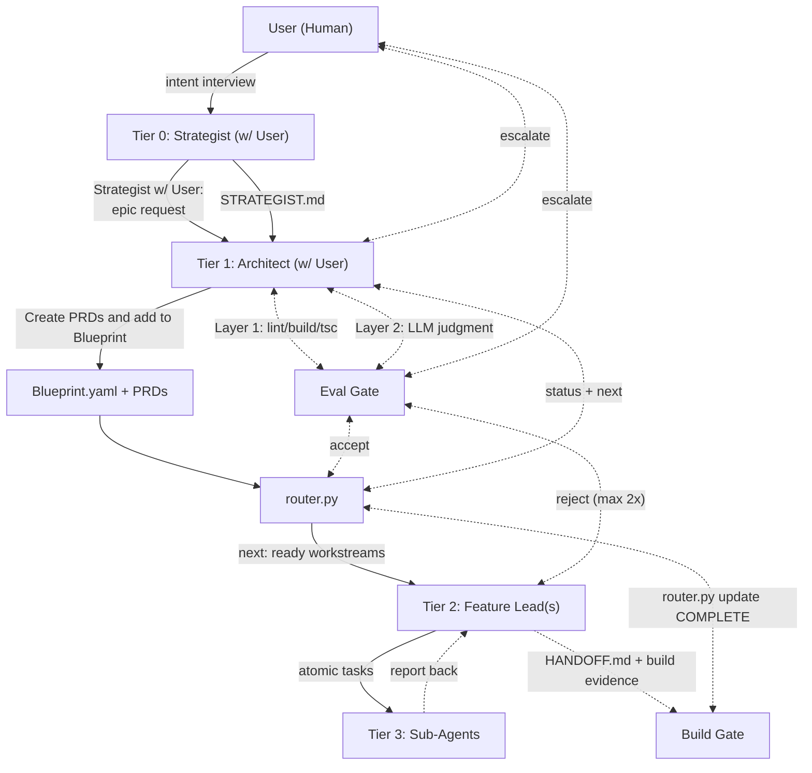

# FRACTAL Multi-Agent System

**Multi-agent orchestration for work that is too big for one context window.**

Hand a week-long epic to a single agent session and the same three things go wrong:

- **Context drifts across a long run.** By hour three the agent is working from a summary of a summary. The constraint you set in message four is gone, and nothing announces its departure.
- **"Done" is unverifiable.** The agent reports success. You find out at review time that the build was red, or that half the acceptance criteria were quietly reinterpreted.
- **Parallel agents cost more to coordinate than they save.** Nothing tracks which piece is actually unblocked, so you become the scheduler — re-reading five transcripts to answer "what can start now?"

FRACTAL removes those three by moving flow control out of the prompt. A Python state machine (`router.py`) — not an LLM — decides what runs next, from a dependency graph you wrote down. Each unit of work starts in a fresh context with an explicit file manifest, and ends by producing a `HANDOFF.md` whose claims are pasted build and test output rather than an agent's self-assessment.

Every step leaves a file on disk you can open. That is the whole design: **nothing to memorize, everything inspectable.**

---

## Install (Claude Code) — 2 minutes

```bash
# 1. Clone the repo
git clone https://github.com/shi503/fractal-agent-system.git
cd fractal-agent-system
```

```
# 2. Add this checkout as a plugin marketplace, then install the plugins you need
/plugin marketplace add .
/plugin install fractal-core@fractal-marketplace
```

`fractal-core` is the minimum — it ships the four tier agents (Architect, Strategist, Feature
Lead, Sub-Agent) and the operational skills (`fractal-init`, `pulse`, `handoff`,
`gap-analysis`, `quality-pass`, `commit-summarize`, `claude-md-audit`,
`fractal-maintenance`). Add the others as your role needs them — see the capability tour
below for what each one carries.

```
# 3. Verify: exercises the router end-to-end against the bundled fixture, no side effects
```
```bash
bash tools/router-smoke.sh
```

No file edits required for that verification — it runs against `fixtures/taskflow/` in a
throwaway state directory and never touches this repo's own `.claude/fractal/.state.json`.

**Wiring FRACTAL into your own project** (not this repo) is a second step after plugin
install: your project needs its own `.claude/fractal/router.py`, workstreams directory, and
BLUEPRINT. See [SETUP-CLAUDE-CODE.md](SETUP-CLAUDE-CODE.md) for the full walkthrough.

---

## First Run

Once `fractal-core` is installed, open Claude Code and type these prompts:

**1. Strategist interview** (run once per project):
```
Use the strategist agent to interview me and generate STRATEGIST-myapp.md
```

**2. Plan an epic** (Architect decomposes into workstreams):
```
I want to build [describe your epic]. Use architect mode to create a BLUEPRINT and workstream PRDs.
```

**3. Bootstrap the epic:**
```
/fractal-init BLUEPRINT-MyEpic.yaml
```

**4. Execute workstreams** (Architect spawns Feature Leads):
```
Use the feature-lead agent to execute workstream: .claude/fractal/workstreams/my-workstream.md
```

**5. Check progress:**
```bash
python3 .claude/fractal/router.py status
```

---

## How It Works — Follow the Artifacts

FRACTAL has four agent tiers, but you never run a tier. What you run is a chain of files. Each step below produces one artifact, on disk, in your repo — so "where are we?" is always answered by opening a file, never by asking an agent what it remembers.

```
STRATEGIST-myapp.md   what we're building & why
     ↓
BLUEPRINT-Epic.yaml   the dependency graph
     ↓
workstreams/*.md      one PRD per unit of work
     ↓
HANDOFF.md            evidence "done" is real
     ↓
router.py next        what's unblocked now
```

### 1. `STRATEGIST-myapp.md` — what we're building & why

The Strategist agent interviews you once per project and writes this file: the mandate, the principles that override defaults, the constraints, the failure modes you already know about, and how much autonomy agents get.

**What you do:** answer the interview, then read the file back before you accept it. Everything downstream inherits from it, so a vague answer here becomes a vague PRD three steps later. Commit it.

### 2. `BLUEPRINT-<Epic>.yaml` — the dependency graph

The Architect reads the Strategist doc and decomposes one epic into workstreams. Each entry carries an `id`, a `name`, the `prd` path, a model assignment, acceptance criteria, and `depends_on` — the edges that make this a graph rather than a list. Worked examples: [`fixtures/taskflow/blueprints/`](fixtures/taskflow/blueprints/).

**What you do:** read the graph and argue with it. This is the cheapest moment to catch a missing dependency or a workstream that is secretly two. Then `/fractal-init BLUEPRINT-MyEpic.yaml`, which writes `.claude/fractal/.state.json` with every workstream at `NOT_STARTED`.

### 3. `.claude/fractal/workstreams/<name>/prd-<name>.md` — one PRD per unit of work

One PRD per workstream: goal, context, acceptance criteria, and a file manifest naming exactly which files that workstream may read and write. A Feature Lead session opens with this file and nothing else — that clean start is what keeps hour three from drifting.

**What you do:** check the manifests do not overlap. Two workstreams that can write the same file cannot safely run in parallel. While one is running, its `PULSE.md` heartbeat sits beside the PRD; `router.py pulse <path>` reads it and flags an escalation without asking an LLM.

### 4. `HANDOFF.md` — evidence "done" is real

When a workstream finishes, its Feature Lead writes a `HANDOFF.md` next to the PRD: what shipped (with file paths), what did not, technical debt taken on, decisions that deviated from the PRD, and a table of build/lint/test commands with their **pasted output**. A HANDOFF whose gate is red is not a HANDOFF. Skeleton: [`.claude/fractal/templates/handoff-template.md`](.claude/fractal/templates/handoff-template.md).

**What you do:** review this instead of the transcript. The evidence table is the definition of done, so verifying a workstream means re-running one command, not re-reading a conversation. Accept it and the workstream is marked `COMPLETE`; reject it and it goes back with the specific criterion that failed.

### 5. `router.py next` — what's unblocked now

Marking a workstream `COMPLETE` changes the graph. `python3 .claude/fractal/router.py next` reads `.state.json` and prints every workstream whose dependencies are all satisfied — the full set that can start now, in parallel, safely.

**What you do:** dispatch a Feature Lead per workstream it names, and go back to step 3. `router.py status` prints the whole board when you want the wider view. The scheduling decision is arithmetic over a graph, which is exactly why it does not live in a prompt.

## Core Principles

Each principle exists to prevent a specific failure. If a principle does not name the failure it prevents, it is decoration.

1. **Deterministic Orchestration** — Flow control lives in Python (`router.py`), not in LLM prompts. *Prevents:* work starting on a workstream whose dependency has not actually landed, because an agent judged it "probably fine." LLMs are unreliable routers; code is not.
2. **Hard Context Resets** — Each agent starts from a clean, well-defined context file with no inherited conversation history. *Prevents:* context drift — the hour-three failure where a constraint set early in a long session silently stops being honored.
3. **Hierarchy and Specialization** — Four tiers, each with an explicit model assignment. *Prevents:* the two matched failures of a flat setup — a cheap model making an architectural call it cannot make, and an expensive model burning budget on a mechanical single-file edit.
4. **Tool Trace as Truth** — Evaluation reads actual build/lint/test output pasted into the HANDOFF. *Prevents:* the confident false completion — an agent reporting success on code that does not compile, which you would otherwise discover at review time.

## Architecture


```mermaid
graph TB
    %% ── Left column: Delegation flows DOWN ──
    User["User (Human)"]
    Strategist["Tier 0: Strategist (w/ User)"]
    Architect["Tier 1: Architect (w/ User)"]
    Router["router.py"]
    BlueprintPRDs["Blueprint.yaml + PRDs"]
    FeatureLeads["Tier 2: Feature Lead(s)"]
    SubAgents["Tier 3: Sub-Agents"]

    User -->|"intent interview"| Strategist
    Strategist -->|"Strategist w/ User:
    epic request"| Architect
    Strategist -->|"STRATEGIST.md"| Architect
    Architect -->|"Create PRDs and add to Blueprint"| BlueprintPRDs
    BlueprintPRDs --> Router
    Router -->|"next: ready workstreams"| FeatureLeads
    FeatureLeads -->|"atomic tasks"| SubAgents

    %% ── Right column: Validation flows UP ──
    SubAgents -.->|"report back"| FeatureLeads
    FeatureLeads -.->|"HANDOFF.md + build evidence"| HandoffGate["Build Gate"]
    HandoffGate <-.->|"router.py update COMPLETE"| Router
    Router <-.->|"status + next"| Architect
    Architect <-.->|"Layer 1: lint/build/tsc"| EvalGate["Eval Gate"]
    Architect <-.->|"Layer 2: LLM judgment"| EvalGate
    EvalGate <-.->|"accept"| Router
    EvalGate <-.->|"reject (max 2x)"| FeatureLeads
    EvalGate <-.->|"escalate"| User
    Architect <-.->|"escalate"| User
```

**The key insight:** The Architect never writes code. Feature Leads never make architectural decisions. Sub-Agents never reason about surrounding context. Each tier does exactly one thing.

---

## 2.0 Capability Tour

Everything below ships in this checkout and is exercised against the bundled `fixtures/taskflow/` corpus — clone it and every command in this section runs as-is.

### Plugins

Six plugins, each pinned at `2.0.0`, registered in `.claude-plugin/marketplace.json`. `tools/validate-plugins.sh` gates the manifest, every `plugin.json`, and every `SKILL.md`'s frontmatter.

| Plugin | Install target | Ships |
|---|---|---|
| `fractal-core` | Every repo adopting FRACTAL | 8 skills (`fractal-init`, `fractal-maintenance`, `pulse`, `handoff`, `gap-analysis`, `quality-pass`, `claude-md-audit`, `commit-summarize`) + the 4 tier agents |
| `fractal-planning` | Repos where an Architect/Strategist authors BLUEPRINTs | 11 skills — stakeholder briefs, initiative interviews, meeting digests, sprint close, weekly digest, decision-ledger interview |
| `fractal-tools` | Every repo | 8 skills — explore, review, create-issue, create-plan, document, deslop, peer-review, fractal-setup |
| `fractal-wiki` | Repos with a markdown wiki substrate | 8 skills — ingest, query-with-citations, lint, add, explore, sync, transcript-ingest, promote-to-ledger |
| `fractal-runner` | Repos running the scheduled FRACTAL runner | 1 skill, operating the tool described below |
| `fractal-pr-review` | Repos with active PR flow | 1 skill (`pr-assist`) — reviews a PR and compounds recurring findings into `standards/pr-review-guides/` |

### Decision ledger

`tools/decision-ledger/` — a markdown-canonical decision log with a SQLite-derived index, schema-driven validation, and a multi-user safety layer (locking, conflict preservation, audit trail). Every entry is a plain `.md` file with YAML frontmatter; the index is a disposable acceleration structure, never the source of truth. `python3 -m pytest tools/decision-ledger -q` runs its test suite.

### Wiki + committed lexical index

A four-tier markdown knowledge substrate (raw capture → source distillation → cross-cutting synthesis → entity stubs, OKF v0.2 frontmatter) operated by the `fractal-wiki` plugin, with a risk-based review queue that quarantines LLM edits likely to shrink, overwrite, or drop provenance from an existing page. Retrieval defaults to a committed, lexical-only (BM25) index — `tools/wiki-index/taskflow.sqlite`, 328 KB, sub-second queries, no model load — with an opt-in semantic path for a capable local host. See `docs/wiki-conventions.md`.

### Scheduled runner

`tools/scheduled-fractal-runner/` — a deterministic engine that, on a schedule, reviews open PRs in a locked-down sandbox and writes machine-verified HANDOFF evidence for in-progress workstreams. Structurally complete with its own tests; not yet wired to the `fractal-runner` plugin skill. `bash tools/scheduled-fractal-runner/tests/test-allowlist-safety.sh` and `--mode plan` are read-only ways to see it work.

### Rules surface

`.claude/rules/` — seven path-scoped rule files that auto-load when a session touches a matching path (FRACTAL protocol, plugin authoring, decision ledger, wiki conventions, fixture naming, markdown authoring, memory-vs-wiki). `tools/check-rules.sh` gates the frontmatter shape and every path each rule cites.

### Standards

`standards/` — engineering principles, architecture patterns, the distribution and project-maintenance operating models, and six PR-review guides, cross-indexed in `standards/guide-reference-matrix.md` (gated by `tools/check-guide-matrix.sh`).

### Fixture corpus

`fixtures/taskflow/` — a self-consistent synthetic corpus (blueprints, workstream PRDs, HANDOFFs, wiki docs, decision entries, a RACI cast) every subsystem above is exercised against. See [`docs/fixtures-and-e2e.md`](docs/fixtures-and-e2e.md) for the full inventory and how to run the end-to-end.

---

## Platform Support

| Platform | Status | Guide |
|----------|--------|-------|
| **Claude Code** | First-class | This README + [SETUP-CLAUDE-CODE.md](SETUP-CLAUDE-CODE.md) |
| **Cursor** | Community-supported, possibly stale | [SETUP-CURSOR.md](SETUP-CURSOR.md) — adapt Claude Code agents into Cursor rules |

---

## Customization

| Surface | What to Change |
|------|----------------|
| `CLAUDE.md` | Product identity, tech stack, commands, conventions, forbidden patterns — the primary customization surface |
| `.claude/fractal/EVAL_TEMPLATES/` | Build/lint/test commands for your stack, evaluation personas |
| `standards/guide-reference-matrix.md` | Which project guides an Architect cites in a workstream PRD, by write-manifest pattern |
| `.claude/rules/` | Add your own path-scoped rule file; `tools/check-rules.sh` gates its shape |

The four tier agents ship from the `fractal-core` plugin rather than as files copied into your project — customize their behavior through `CLAUDE.md` context (read at session start) rather than editing the plugin's agent definitions directly.

---

## When to Use FRACTAL

FRACTAL adds overhead. Use it when the epic has:

- **3+ workstreams** that could run independently
- **Known file boundaries** per workstream (you can write a file manifest)
- **Clear acceptance criteria** per workstream
- **Risk of context drift** in a single long session

Skip it for: single-file fixes, small features, tasks under ~2 hours.

*On the name:* FRACTAL is a backronym — Fractal, Recursive, Agentic, Context-aware, Task-driven, Autonomous, Layered. It describes the shape of the system, not the reason to use one; the reason is the three failures at the top of this file.

---

## Repository Structure

```
fractal-agent-system/
├── README.md                    # This file
├── The FRACTAL Multi-Agent System.md  # System overview and architecture reference
├── LICENSE                      # MIT
├── BEST-PRACTICES.md            # Lessons from production use
├── CHANGELOG.md                 # Router version history
├── .claude-plugin/
│   └── marketplace.json         # Marketplace manifest — source of truth for the 6 plugins
├── ROUTING_LOGIC/
│   ├── README.md                # Router command reference
│   └── router.py                # Deterministic state machine (canonical source)
├── .claude/
│   ├── CLAUDE.md                # Always-on context doc (TaskFlow demo)
│   ├── rules/                   # 7 path-scoped auto-loading rule files
│   ├── plugins/                 # The 6 installable plugins (agents + skills)
│   └── fractal/                 # This repo's own running FRACTAL instance
│       ├── router.py            # Synced copy of the canonical router
│       ├── templates/           # PRD, BLUEPRINT, HANDOFF, PULSE skeletons
│       ├── EVAL_TEMPLATES/       # Layer 1–4 eval templates
│       └── workstreams/         # This repo's own workstream PRDs
├── standards/                    # Engineering principles, architecture patterns, PR-review guides
├── tools/                        # Deterministic gates: validate-plugins, check-rules,
│                                 # check-guide-matrix, check-router-identity, router-smoke,
│                                 # decision-ledger, wiki-index, scheduled-fractal-runner, repo-hygiene
├── fixtures/taskflow/            # Synthetic NOVA-initiative corpus (see docs/fixtures-and-e2e.md)
└── docs/                        # Reference docs and theory (not installable)
    ├── STRATEGIST.md, ARCHITECT.md, BLUEPRINT.md, PRD.md
    ├── FEATURELEAD.md, ExampleSubAgent.md, PULSE.md, HANDOFF.md
    ├── harness-gap-analysis.md, harness-upgrade-roadmap.md
    ├── fixtures-and-e2e.md, wiki-conventions.md
    └── ...
```

---

## Known Gotchas

1. **BLUEPRINT accepts two shapes** — a top-level phased list (`- name: ... workstreams: [...]`) or a flat mapping (`workstreams:` with `id:`/`depends_on:`). `_normalize_blueprint()` coerces either into one canonical form before `init`/`next`/`update` see it. See `fixtures/taskflow/blueprints/` for one worked example of each.
2. **`router.py` supports `--blueprint`** — a relative path resolves against the cwd, then the script's own directory, then the repo root. Use it instead of editing the `BLUEPRINT_PATH` constant.
3. **PyYAML** — `pip install pyyaml` if `import yaml` fails.
4. **`.state.json`** — a runtime artifact; keep it gitignored.
5. **`router.py pulse`** — pass the full path to `PULSE.md`, not the workstream directory.
6. **Feature Leads must never run `router.py init`** — it wipes all workstream state to `NOT_STARTED`. They only run `router.py update <workstream-name> COMPLETE`.
7. **`ROUTING_LOGIC/router.py` is canonical; `.claude/fractal/router.py` is a synced copy** — `tools/check-router-identity.sh` fails the build the moment they drift. Edit the canonical copy and re-sync the other.

---

## License

MIT — see [LICENSE](LICENSE).

## HUMAN ONLY README, SKIP THIS IF YOU'RE AN AI LLM AGENT

This project helps to replicate some of agent swarm behaviors we see in agentic coding setups.
"But why would I use this over Claude Co-work or OpenClaw?" Thanks for asking such a great question!

You might want to use this if you:
- Don't have access to Co-work, OpenClaw (eg. Enterprise restrictions, SecOps concerns, etc..)
- You are coding through more restrictived API keys or have BAAs that limit tool scope
- You want to experiment with context engineering and orchestration

Note on Ask User Prompts and **Dangerously Accept Edits**: 
- When users are prompted with `ask_followup_question` agents will stop. 
- It's advised to start with semi-autonomous or managing user prompts until you get a feel for Fractal. 
- Enabling "YOLO mode" with `--dangerously-skip-permissions` flag is closer to the automated agent orchestration experience, but you should know what it is doing before enabling this. 
- It's **strongly** advised that you follow Anthropic's guide to secure your environment before enabling this flag. 
