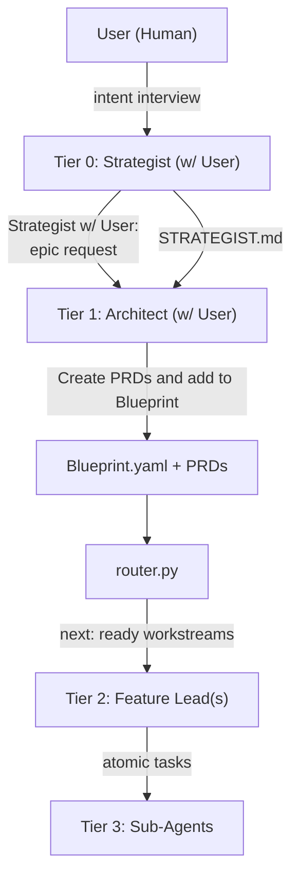
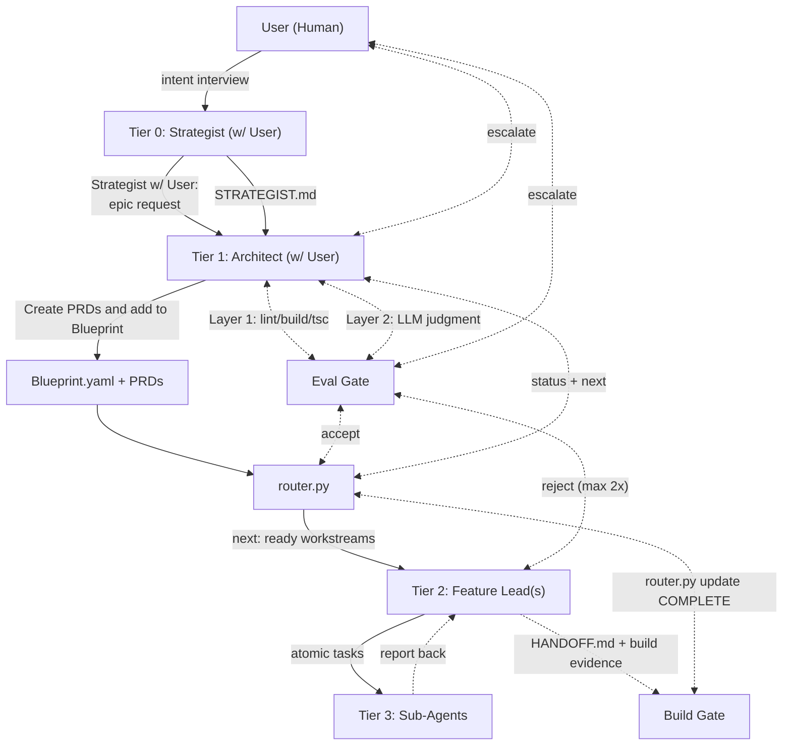

# The FRACTAL Multi-Agent System

Welcome to the FRACTAL (Fractal, Recursive, Agentic, Context-aware, Task-driven, Autonomous, Layered) multi-agent system. This system provides a structured, hierarchical framework for orchestrating teams of AI agents to perform complex software development tasks. It is designed to be robust, predictable, and transparent, drawing on best practices from modern agentic design patterns.

## Core Philosophy

The FRACTAL system is built on four core principles:

1. **Hierarchy and Specialization:** The system is organized as a fractal hierarchy of agents, where each level has a specific role and a specialized set of skills. This mirrors the structure of a human software development team.
2. **Deterministic Orchestration:** The flow of work is controlled by a deterministic state machine (router.py), not by an LLM. This ensures that the system is predictable and that agents remain focused on assigned tasks.
3. **Hard Context Resets:** Agents do not maintain long-running conversational history. Each agent starts with a clean, well-defined context (the workstream PRD). This prevents context drift.
4. **Tool Trace as Truth:** The evaluation framework is based on actual build/test output and state changes, not on the agent's self-reported narrative.

## The Four Tiers

The system operates top-down, starting with the **Strategist** and moving to **Sub-Agents**.

1. **The Strategist (Tier 0):** Captures project-level intent in `STRATEGIST.md` — WHY the project exists and WHAT good looks like. The Strategist is re-engaged at major priority shifts and milestone boundaries.
2. **The Architect (Tier 1):** The central orchestrator. Creates the BLUEPRINT, authors workstream PRDs, evaluates HANDOFFs (Layers 1-2), and manages escalations. Never writes implementation code.
3. **The Feature Leads (Tier 2):** Each Feature Lead owns one workstream. It reads the PRD, implements all changes in the file manifest, runs the build gate, and generates a HANDOFF.md on completion.
4. **The Sub-Agents (Tier 3):** Execute single atomic tasks delegated by Feature Leads. One task, one file manifest, terminates on completion.



## 4-Layer Evaluation Pipeline

Every workstream goes through up to 4 evaluation layers:

| Layer | Owner | Blocks HANDOFF? | What It Checks |
|-------|-------|-----------------|----------------|
| Layer 1 — Deterministic | Architect | Yes | Build, lint, typecheck, security audit, diff scope |
| Layer 2 — LLM Judgment | Architect | Yes | Intent alignment, architecture idioms, security/compliance, pattern consistency |
| Layer 3 — Qualitative Persona | Strategist | No (informs backlog) | Would real users trust this? Workflow fit, UX, domain accuracy |
| Layer 4 — Strategic Benchmark | Strategist | No (informs roadmap) | Are we building the right thing? Competitive positioning |



**2-Attempt Retry Policy:** If a layer fails twice, escalate to the next tier up — do not loop indefinitely.

## Getting Started
```bash
# 1. Copy into your project as .claude
cp -r fractal-agent-system/example-claude /path/to/your-project/.claude

# 2. Verify PyYAML
python3 -c "import yaml; print('ok')"
# If missing: pip install pyyaml
```

Then open Claude Code in your project:

1. **Strategist interview** (once per project): `Use the strategist agent to interview me and generate STRATEGIST-myapp.md`
2. **Plan an epic**: `I want to build [your feature]. Use architect mode to create a BLUEPRINT and workstream PRDs.`
3. **Bootstrap**: `/fractal-init BLUEPRINT-MyEpic.yaml`
4. **Execute workstreams**: `Use the feature-lead agent to execute workstream: .claude/fractal/workstreams/my-workstream.md`
5. **Check progress**: `python3 .claude/fractal/router.py status`

See [SETUP-CLAUDE-CODE.md](SETUP-CLAUDE-CODE.md) for the full step-by-step setup guide.See `SETUP-CLAUDE-CODE.md` for the full step-by-step setup guide.

## Directory Structure (Claude Code Integration)

After setup, your project looks like:

```
.claude/
├── CLAUDE.md                    # Always-on project context (customize for your project)
├── agents/
│   ├── architect.md             # Architect — Opus, with FRACTAL Architect Mode
│   ├── feature-lead.md          # Feature Lead — Sonnet
│   ├── sub-agent.md             # Sub-Agent — Sonnet (NOT Haiku for typed code)
│   └── strategist.md            # Strategist — Opus
├── skills/
│   ├── fractal-init/SKILL.md    # Bootstrap FRACTAL epic session
│   ├── pulse/SKILL.md           # Feature Lead heartbeat + escalation check
│   ├── handoff/SKILL.md         # Build gate + HANDOFF.md + router COMPLETE
│   ├── gap-analysis/SKILL.md    # Milestone boundary gap analysis
│   ├── commit-summarize/SKILL.md # Phase/epic commit + optional PR creation
│   └── quality-pass/SKILL.md   # AI slop cleanup before handoff
└── fractal/
    ├── router.py                # Deterministic state machine
    ├── BLUEPRINT-{Epic}.yaml    # One per epic (committed to git)
    ├── STRATEGIST-{project}.md  # Project-level Seed of Intent (committed)
    ├── STRATEGIST-example.md    # Sample completed Strategist doc (reference)
    ├── .state.json              # Runtime state (GITIGNORE this)
    ├── ISSUES.md                # Framework-level issue log template
    ├── EVAL_TEMPLATES/          # Evaluation templates (Layer 1–2 required; 3–4 optional)
    │   ├── deterministic-eval.md    # Layer 1 (required)
    │   ├── llm-judgment-eval.md     # Layer 2 (required)
    │   ├── qualitative-persona-eval.md   # Layer 3 (optional, Strategist-owned)
    │   └── strategic-benchmark-eval.md   # Layer 4 (optional, Strategist-owned)
    ├── intake/
    │   └── README.md            # Strategist intake folder guide (contents gitignored)
    └── workstreams/
```

## A Note on Determinism

While orchestration is deterministic, the work performed by agents is not. The FRACTAL system manages non-determinism — not eliminates it. The deterministic routing layer ensures agents work on the right tasks at the right time, and their work is evaluated against consistent criteria. The 2-attempt retry policy caps runaway loops.
